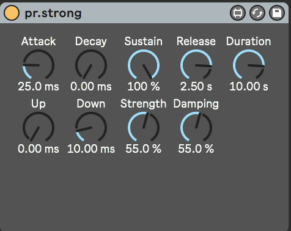

# Pierre Rhinocéros' Karplus-Strong Instrument
A simple Karplus-Strong polyphonic instrument.

## Installation
The simplest way to install this Max for Live device is to download the latest
[release](https://github.com/neta-elad/pr.strong/releases).

If you want to build it yourself, you will first need to install the 
[pr.dev-tools](https://github.com/neta-elad/pr.dev-tools) package.
Then, simply clone this repository and in Max, use the File -> "Export Max for Live Device..." command.